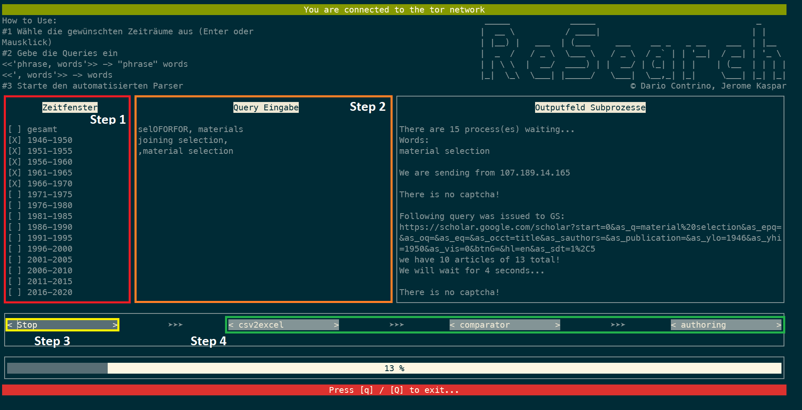

# torscholar-tui

     _____            _____                                _     
    |  __ \          / ____|                              | |    
    | |__) |   ___  | (___     ___    __ _   _ __    ___  | |__  
    |  _  /   / _ \  \___ \   / _ \  / _` | | '__|  / __| | '_ \ 
    | | \ \  |  __/  ____) | |  __/ | (_| | | |    | (__  | | | |
    |_|  \_\  \___| |_____/   \___|  \__,_| |_|     \___| |_| |_|
    © Dario Contrino, Jerome Kaspar

*if you are already running a linux system you can skip this step*
# How to install Ubuntu on Windows
We will have to install the WSL (*Windows Subsystem for Linux*) to use a Linux system easily on our windows machine. No need for an external VM program etc.

1. Go to the Microsoft store and install the "Ubuntu" app
2. Open your PowerShell as an admin and enter the following command: [more infos one the official Microsoft website](https://docs.microsoft.com/en-us/windows/wsl/install)
>`wsl --install`

3. Restart your computer
4. Open `Ubuntu` via your launcher and now you have to setup your account to use it further

# Software prerequisites
## mandatory software
---
- **python >= 3.0**\
check in your commandline via:
>`python --version`

Update your package repositories via:
>`sudo apt-get update`

If your python version < 3.0 you can install it via:
>`sudo apt-get install python3`
---
- tor

Install the tor service via:
>`sudo apt-get install tor`

Now we have to activate the tor control port to allow our parser to request a new identity.\
We have to find the `torrc` file in `/etc/tor/torrc`

You can either edit it via a commandline tool like `vim`, `emacs` or `nano` OR you can use your Windows tools like `notepad` or `notepad++` to edit the `torrc` file.\
(If you try to open files on your WSL the path to the root directory is **`\\wsl.localhost`** (Win11) OR **`\\wsl$\Ubuntu`** (Win10)\
Just insert it into your Explorer and you can traverse your Linux Subsystem)

First you have to generate a salted hash for the password used by the controller. You can do this via:
>`tor --hash-password $YOUR_PASSWORD$`

You will get an alphanumeric string like this:
>`16:A7509838B0530B8260F43993AFDC0B91B24BEC99B6E98EEFCC62C1ED05`

Copy this string for the next step.\
Now open the `/etc/tor/torrc` file with an editor of your choice **(You need to open as an admin!).**

Search a line with `"# ControlPort 9051"` and delete the `"# "` (inclusive the space). A few lines later there should be a line with `"# HashedControlPassword"`.\
Now you need the aforementioned hash. Delete the `"# "` and insert the hash afte rthe variable like: `"HashedControlPassword 16:A7509838B0530B8260F43993AFDC0B91B24BEC99B6E98EEFCC62C1ED05"`

Save the file now and you should be almost ready to use torscholar.

Now you just have to input your password (not the hash!) in the `/src/parser/torscholar.py` file (and in the `/GoogleParser/torscholar.py` file if you want to use the parser manually) into the **`CONTROLLER_PASS`** Variable.
>**THIS IS NOT PARTICULARLY SAFE! USE A DUMMY PASSWORD! SUBJECT TO CHANGE! maybe...**

To Do:\
&#x25EF; safer storage of controller password

---
### python modules
We will be using `pip3` to install all needed modules for python. Just install the `python-pip3` package via

>`sudo apt-get install python-pip3`

and run the following command to install all needed python modules:

>`pip3 install stem random_user_agent beautifulsoup4 urwid pandas openpyxl pysocks`

Every other module *should* be already installed, if not just install them with `pip3 install $MODULE_NAME$`. You cannot use `pip search *` atm, but you can search on the [PyPI Website](https://pypi.org).

# formatting and data-input for torscholar-tui
## yearlist
---
At the moment you would have to change the hardcoded yearlist in the `tory.py` file.

To Do:\
&#x25EF; load yearlist from file

## queries
---
You have to insert the wanted queries in the center column in `tory.py`

The queries need to be separated by a newline-character.

A query consists of 2 parts:
>`PHRASE,WORDS`

The `phrase` will be enclosed in quotation marks on google scholar. This means that exactly this combination of letters and words need to be in the title of the article. You **DO NOT NEED** to enclose the phrase part of the query in quotation marks!

The `words` will not be enclosed in quotation marks. This means that the words can be arranged in any order in the title and even some simple permutations (e.g. `project` in the phrase will also find articles with the word `projects` in the title).

There needs to be a `","` in the query! This seperates the `phrase` part from the `words` part.

The filename base will be the concatenation of the parts of the query.
>`choice of, material selection -> choice_of_material_selection`

## examples:

- `choice of, process`\
you will be looking for `"choice of" process` in Google Scholar.

- `,material selection`\
you will be looking for `material selection` (without a phrase!) in Google Scholar

- `welding process,`\
you will be looking for `"welding process"` (without words!) in Google Scholar
---
---
# How to Use Tory

## Step 1

Select the years you would like to parse. If you need to change the ranges you can easily change them inside `tory.py`.

If you would like to parse the whole GS Database without filtering by years just select "gesamt" and the parser will ommit the `--before` and `--after` arguments.

## Step 2
Insert your queries. For the Format of the queries look at the [queries chapter.](#queries)

## Step 3
Start the parser with the "Start" button. You can traverse the window with your mouse or even klick on checkboxes and buttons.

## Step 4
There are other helper scripts to further analyze your data.

- `csv2excel` takes the **.csv* files in the main directory and converts them to *.xlsx* files.\
They will show up in `./excel/finished`. As it was crucial to improve the user interfacing for these files they will have 2 columns appended to their left. `0/1` is for coding the files (whether they fit in a certain dataset) and `comment` can contain the flag "doppelt" which will be used by other scripts to discard these articles.
- `comparator` will compare two datasets.\
You need to put two datasets in the `./comparison/db1` and `./comparison/db2` directories. The `comparator` will look for dissimilarities in the datasets and outputs the differences in the `./diffs` directory with the suffix "*DIFFS*". Unique files will be put into `./unique` and similar files (in db1 and db2 and similar to each other) will be put into `./similar`
- `authoring` starts a subprocess to analyze the authors and the number of their citations. This can be used to generate Data on different fields and the researchers impact.\
The raw data has to be put into the `./authoring/Rohdaten` directory. There you can define your needed fields of research. E.g.: We looked at the fields of "*JOINING*", "*MATERIALS*", "*PROCESS*". The output will be generated in the `./authoring` directory as an *.xlsx* file and grouped by the fields you defined. You can also define just one field.