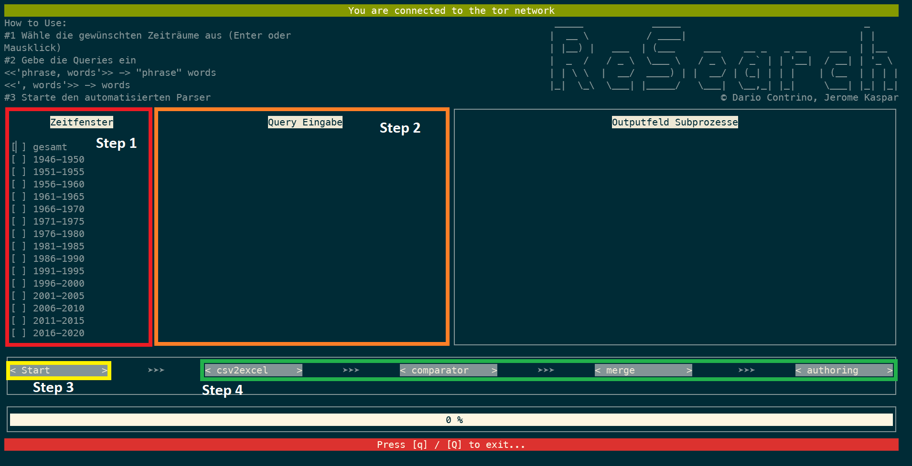

# torscholar-tui

     _____            _____                                _     
    |  __ \          / ____|                              | |    
    | |__) |   ___  | (___     ___    __ _   _ __    ___  | |__  
    |  _  /   / _ \  \___ \   / _ \  / _` | | '__|  / __| | '_ \ 
    | | \ \  |  __/  ____) | |  __/ | (_| | | |    | (__  | | | |
    |_|  \_\  \___| |_____/   \___|  \__,_| |_|     \___| |_| |_|
    © Dario Contrino, Jerome Kaspar

*if you are already running a linux system you can skip this step*
# How to install Ubuntu on Windows
We will have to install the WSL (*Windows Subsystem for Linux*) to use a Linux system easily on our windows machine. No need for an external VM program etc.

1. Go to the Microsoft store and install the "Ubuntu" app
2. Open your PowerShell as an admin and enter the following command: [more infos one the official Microsoft website](https://docs.microsoft.com/en-us/windows/wsl/install)
>`wsl --install`

3. Restart your computer
4. Open `Ubuntu` via your launcher and now you have to setup your account to use it further

# basic Linux command
This might be your first time using linux. Don't worry! It is easier than you think. Here I will show you the basics on the following topics:

1. traversing directories
2. starting and stopping scripts
3. opening, changing and deleting files

## traversing directories
When you open the Ubuntu terminal you will be greeted by a simple `~` symbol. This is your home directory.

### --> **_ls_**

You can list all the files and directories with the `ls` (from `l`i`s`t) command. You can distinguish between files and directories by their different colors. It might be different for your system which colors are used but you will get the hang of it.

### --> **_cd_**

If you want to go into a directory you will use the `cd` (from `c`hange `d`irectory) command. If the directory is in your current directory simply append the directory name to the `cd` command: `'cd test-directory'`. You might try to press `TAB` after some characters and the shell tries to autocomplete the name of the file or directory name.

You can also change to directories which are 'farther away' by simply giving the `cd` command the full path: `'cd /home/user/test-directory'`.

[This webpage from The Linux Foundation](https://www.linux.com/training-tutorials/linux-filesystem-explained/) is a great resource to learn more about the Linux filesystem and why there are so many folders in the `/` directory and what they are used for.

Tip: If you just type `cd` without any path you will change directory to your home directory.

### --> **_explorer.exe ._**

You are also able to traverse your linux system with the windows explorer. This is the beauty and simplicity of WSL. The dot `'.'` is your _current_ directory. So if it is easier for you to work with the windows explorer you are free to do so.

It is also a good idea to have a quick link to your Ubuntu home directory ready. When you are in the home directory use the `'explorer.exe .'` (mind the `dot`) command to open the windows explorer in the current (home) directory.

## starting and stopping scripts

I will give you the basics of starting Python scripts.

### --> __*python3 $SCRIPT*__
We are using Python with a version >3.0. Therefore we need the `python3` command. If you want you can change the default behaviour of the `python` command to open `python3`.

Simply append the scriptname to the command and press Enter.

Tip: Most scripts (not only Python scripts!) accept arguments (e.g. `python3 torscholar.py -A "test" -s "input"` --> -A and -s are the arguments in this case) and often have a help menu with `-h` or `--help`. These arguments are given to the script and are appended to the back.

### --> __*CTRL+C*__
If you want to stop a script which is running you have to press `CTRL+C`. This will send a SIGINT (`SIG`nal `INT`errupt) to the process and close it.

## opening, changing and deleting files
In this small chapter I will show you how easy it is to use WSL to incorporate the tools you might already be using (e.g. notepad) to edit files.

### --> __*notepad.exe $FILENAME*__
As in `explorer.exe` we can use windows tools like the notepad to open and edit files from WSL. Just type the `notepad.exe $FILENAME` command and the notepad app will open with your file. There you can edit lines, save it or save as a new file.

### --> __*vim*__ && __*nano*__
There is also the possibility to stay in the terminal and change contents of a text file with `vim` or `nano`. It might take you a while to get used to them (especially vim) but it is worth it! If you are changing files frequently it will save you time to make your modifications, additions and deletions in a file directly in the termina as you do not have to wait for notepad to open.

If you want to learn more about `vim` there is a very nice [interactive vim tutorial](https://www.openvim.com) over at the openvim website.

There is also a [basic tutorial](https://staffwww.fullcoll.edu/sedwards/nano/introtonano.html) for the `nano` editor. I personally prefer vim as it is much more adaptable to your needs (even addons for scripting LSDYNA input files exist) but for a quick line change nano is always an option.

### --> __*rm $FILENAME*__
To delete a file - you may have needed some notes but now they are clogging your directory - you will use the `rm` (from `r`e`m`ove) command.

Just append the  filename to the `rm` command and the file will be deleted: `rm test.dat`

If you want to delete a whole directory you ahve to use the `-r` argument (`-r` from `r`ecursively deleting a directory): `rm -r test-directory`.
You can get more infos about the `rm` command with the `-h` argument (remember the _starting and stopping scripts_ chapter?).

# Software prerequisites
## mandatory software
---
- **python >= 3.0**\
check in your commandline via:
>`python --version`

Update your package repositories via:
>`sudo apt-get update`
and install the updates via:
>`sudo apt-get upgrade`

If your python version < 3.0 you can install it via:
>`sudo apt-get install python3`
---
- tor

Install the tor service via:
>`sudo apt-get install tor`

Now we have to activate the tor control port to allow our parser to request a new identity.\
We have to find the `torrc` file in `/etc/tor/torrc`

You can either edit it via a commandline tool like `vim`, `emacs` or `nano` OR you can use your Windows tools like `notepad` or `notepad++` to edit the `torrc` file.\
(If you try to open files on your WSL the path to the root directory is **`\\wsl.localhost`** (Win11) OR **`\\wsl$\Ubuntu`** (Win10)\
Just insert it into your Explorer and you can traverse your Linux Subsystem)

First you have to generate a salted hash for the password used by the controller. You can do this via:
>`tor --hash-password $YOUR_PASSWORD$`

You will get an alphanumeric string like this:
>`16:A7509838B0530B8260F43993AFDC0B91B24BEC99B6E98EEFCC62C1ED05`

Copy this string for the next step.\
Now open the `/etc/tor/torrc` file with an editor of your choice **(You need to open as an admin!).**

Search a line with `"# ControlPort 9051"` and delete the `"# "` (inclusive the space). A few lines later there should be a line with `"# HashedControlPassword"`.\
Now you need the aforementioned hash. Delete the `"# "` and insert the hash afte rthe variable like: `"HashedControlPassword 16:A7509838B0530B8260F43993AFDC0B91B24BEC99B6E98EEFCC62C1ED05"`

Save the file now and you should be almost ready to use torscholar.

Now you just have to input your password (not the hash!) in the `/src/parser/torscholar.py` file (and in the `/GoogleParser/torscholar.py` file if you want to use the parser manually) into the **`CONTROLLER_PASS`** Variable.
>**THIS IS NOT PARTICULARLY SAFE! USE A DUMMY PASSWORD! SUBJECT TO CHANGE! maybe...**

To Do:\
&#x25EF; safer storage of controller password

---
### python modules
We will be using `pip3` to install all needed modules for python. Just install the `python-pip3` package via

>`sudo apt-get install python3-pip`

and run the following command to install all needed python modules:

>`pip3 install requests stem random_user_agent beautifulsoup4 urwid pandas openpyxl pysocks rich tqdm multiprocess`

Every other module *should* be already installed, if not just install them with `pip3 install $MODULE_NAME$`. You cannot use `pip search *` atm, but you can search on the [PyPI Website](https://pypi.org).

# formatting and data-input for torscholar-tui
## yearlist
---
At the moment you would have to change the hardcoded yearlist in the `tory.py` file.

To Do:\
&#x25EF; load yearlist from file

## queries
---
You have to insert the wanted queries in the center column in `tory.py`

The queries need to be separated by a newline-character.

A query consists of 2 parts:
>`PHRASE,WORDS`

The `phrase` will be enclosed in quotation marks on google scholar. This means that exactly this combination of letters and words need to be in the title of the article. You **DO NOT NEED** to enclose the phrase part of the query in quotation marks!

The `words` will not be enclosed in quotation marks. This means that the words can be arranged in any order in the title and even some simple permutations (e.g. `project` in the phrase will also find articles with the word `projects` in the title).

There needs to be a `","` in the query! This seperates the `phrase` part from the `words` part.

The filename base will be the concatenation of the parts of the query.
>`choice of, material selection -> choice_of_material_selection`

## examples:

- `choice of, process`\
you will be looking for `"choice of" process` in Google Scholar.

- `,material selection`\
you will be looking for `material selection` (without a phrase!) in Google Scholar

- `welding process,`\
you will be looking for `"welding process"` (without words!) in Google Scholar
---
---
# How to Use Tory

## Step 0

If you cloned the project and did all the needed work with inputing your hashed tor stem password you will have to enter the `torscholar-tui` directory.

In this directory you will find the `tory.py` file which is the TUI for the Parser and its components like `csv2excel` and `authoring`.

You can start the script via the `python3 tory.py` command!

You should be greeted by an interface similar to this one (it might be, that you have a different color scheme and fonts installed in your terminal):

## Step 1

Select the years you would like to parse. If you need to change the ranges you can easily change them inside `tory.py`.

If you would like to parse the whole GS Database without filtering by years just select "gesamt" and the parser will ommit the `--before` and `--after` arguments.

## Step 2
Insert your queries. For the Format of the queries look at the [queries chapter.](#queries)

## Step 3
Start the parser with the "Start" button. You can traverse the window with your mouse or even klick on checkboxes and buttons.

## Step 4
There are other helper scripts to further analyze your data.

- `csv2excel` takes the **.csv* files in the main directory and converts them to *.xlsx* files.\
They will show up in `./excel/finished`. As it was crucial to improve the user interfacing for these files they will have 2 columns appended to their left. `0/1` is for coding the files (whether they fit in a certain dataset) and `comment` can contain the flag "doppelt" which will be used by other scripts to discard these articles.
- `comparator` will compare two datasets.\
You need to put two datasets in the `./comparison/db1` and `./comparison/db2` directories. The `comparator` will look for dissimilarities in the datasets and outputs the differences in the `./diffs` directory with the suffix "*DIFFS*". Unique files will be put into `./unique` and similar files (in db1 and db2 and similar to each other) will be put into `./similar`
- `authoring` starts a subprocess to analyze the authors and the number of their citations. This can be used to generate Data on different fields and the researchers impact.\
The raw data has to be put into the `./authoring/Rohdaten` directory. There you can define your needed fields of research. E.g.: We looked at the fields of "*JOINING*", "*MATERIALS*", "*PROCESS*" --> you will have to create 3 directories with their respective name and put the corresponding files into the directory. The output will be generated in the `./authoring` directory as an *.xlsx* file and grouped by the fields you defined. You can also define just one field.

# How to compare and merge two datasets

If you parsed a set of queries at two different times you might want to compare and even merge those two datasets. This can be done via the `comparator.py` and `merger.py` tools in the `./src/dataManip` directory.

## comparator.py
You can either invoke the script via the tory TUI or directly with `python3 ./src/dataManip/comparator.py`.

You need to put two datasets in the `./comparison/db1` and `./comparison/db2` directories. The `comparator` will look for dissimilarities in the datasets and outputs the differences in the `./diffs` directory with the suffix "*DIFFS*". Unique files will be put into `./unique` and similar files (in db1 and db2 and similar to each other) will be put into `./similar`. If there are any non-coded rows a file with the suffix "NOT_CODED" will be created.

You will have to manually code the files and merge them with their respective file: NOT_CODED_xxx_1900-1999.xlsx --> xxx_1900-1999.xlsx

## merger.py
This script will merge all the files from the directories `./unique`, `./similiar` and `./diffs` into the `./merged` directory. It will also automatically filter out duplicates in a single file.

You can start the script via the `python3 ./src/dataManip/merger.py` command. A simplified output will be printed to stdout but more extensive information will be written to a `merger.log` file in the root directory.

# How to get the data from the coded excel sheets

The script `./GoogleParser/data_farm.py` will be used to parse all the coded files and output a human-readable table inside another excel file.

Inside the `./GoogleParser/data_farm.py` script you can manually define the year range you would like to evaluate (simply change the list with the name `years`).

Before you start the script you have to put all your coded files into the `./GoogleParser/data` directory. Now you can run the script via `python3 ./GoogleParser/data_farm.py`.

The script will output another excel file in the `./GoogleParser/data/output` directory. Every file will be broken down into two rows:

1. POSITIVES -> If you coded it with a 1
2. NEGATIVES -> If you coded it with a 0

All titles which have a code AND have the comment "doppelt" will be discarded.
